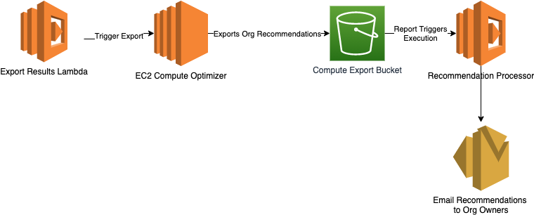

# Right Sizing Recommendation

*Problem:* Find a way to email EC2 Rightsizing recommendations either through Cost Explorer or EC2 Compute Analyzer to Account Owners. Account Owner email addresses are different than account email addresses. What options do we have for this? 
*Solution: *

### Architecture Flow
1. Step 1: Trigger Report Export 
  
    The Compute optimizer API exports optimization recommendations for Amazon EC2 instances.Recommendations are exported in a comma-separated values (.csv) file, and its metadata in a JavaScript Object Notation (.json) file, to an existing Amazon Simple Storage Service (Amazon S3) bucket that you specify.
     * Using the Lambda function, Compute Optimizer API is called. The user specifies the request syntax in JSON format and includes the fields to export. The format of the exported recommendation file is csv. 
     * __If the action is successful, the service returns HTTP 200 response and the csv file with recommendations is exported to the destination S3. For detailed instruction on how to implement the api call refer to https://docs.aws.amazon.com/compute-optimizer/latest/APIReference/API_ExportEC2InstanceRecommendations.html__
2. Step 2: Recommendation Export
      * Once all the required recommendation csv files are in a S3 bucket. 
3. Step 3: Setup SES
    
    In the console, head over to SES management console. Add and verify the email address to be used for sending the emails. 
      * Setup an IAM role with following permissions for Lambda: 
        * Access to SES to send emails
        * Access to S3 to send attachments
        * Access to CloudWatch to store execution logs
        * Setup Lambda function to read from the S3 bucked containing .csv files and send the files as an attachment to the email address of the account owners. Refer to the following [this](https://medium.com/@xoor/sending-emails-with-attachments-with-aws-lambda-and-node-js-e6a78500227c) for detailed instructions. 
4. Deploy Lambdas(Using [SAM](https://aws.amazon.com/serverless/sam/) Templates)
      * [trigger-computeoptimizer-export](https://github.com/genericinternetcompany/rightSizing/tree/main/trigger-computeoptimizer-export)
      * [email-optimizerrecommendations-orgowner](https://github.com/genericinternetcompany/rightSizing/tree/main/email-optimizerrecommendations-orgowner)
5. Create CloudWatch Trigger to launch Lambda monthly/daily/weekly

 

__Note: 
The user should update their accounts to owner email addresses, so that AWS Organizations API could be used to get email addresses of the account owners.Please refer https://docs.aws.amazon.com/organizations/latest/APIReference/API_ListAccounts.html. for more information on the API. 
This approach could save the requirement for a data store to store the account owner information.__
